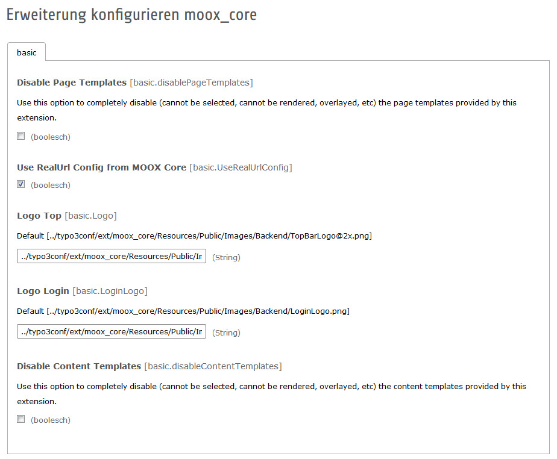
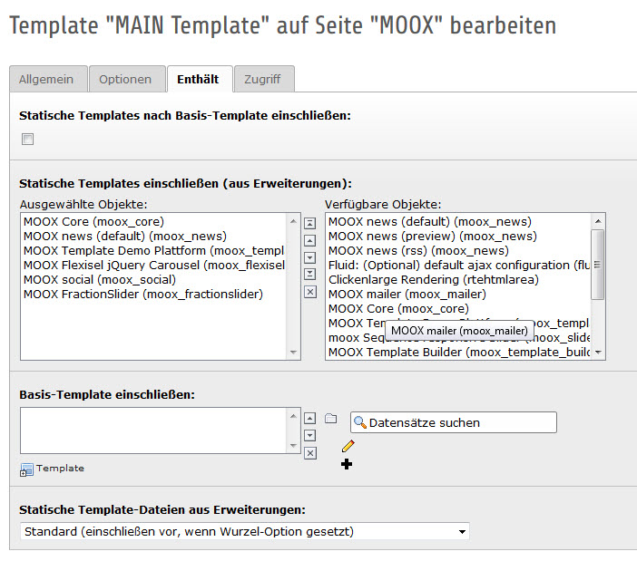
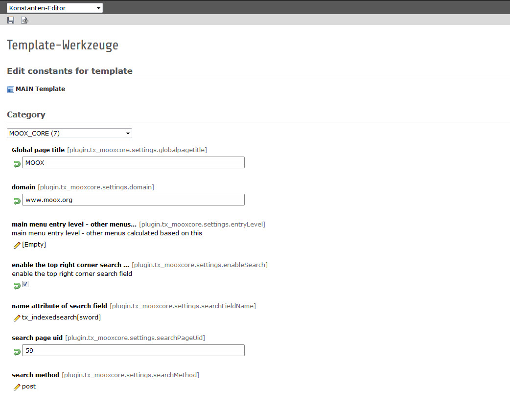

.. include:: Images.txt

.. ==================================================
.. FOR YOUR INFORMATION
.. --------------------------------------------------
.. -*- coding: utf-8 -*- with BOM.

.. ==================================================
.. DEFINE SOME TEXTROLES
.. --------------------------------------------------
.. role::   underline
.. role::   typoscript(code)
.. role::   ts(typoscript)
   :class:  typoscript
.. role::   php(code)

Administration
--------------

There are some Extension properties to configure

- **Disable Page Template** moox\_core ships some page templates. If you
  use a MOOX Template you may disable this page templates to hide them
  from the page properties.

- **Use RealURL Config from MOOX Core** moox\_core installs realurl as
  dependency, adds the needed .htaccess and configures realurl
  automatically. If you are able and willing to write your own realurl-
  configuration you can disable this feature here.

- **Logo Top and Logo Login** Once installed, your TYPO3 Backend and
  Login-Screen shows our neat logo. You may customize this and enter the
  paths to your company logo here.

- **Disable Content Elements** Same as Disable Page Template: you may
  disable moox\_core's content elements as well.

Configuration
-------------

If you did not import a ready-to-run pagetree you should start
creating a rootpage and include the static templates in following
order:

MOOX Bootstrap Responsive (moox\_core)

MOOX Main Extensions (like moox\_news)

MOOX Content Extensions (like moox\_sequence)

MOOX Template (extension\_key\_of\_template)

On your newly created Rootpage go to  *Template* and choose
*Info/Edit* then click on  *Edit the whole template record.* Click the
Tab *Contains* and add the static templates by doubleclicking them in
the left window and the will show as added on the left.

Now you can configure the Domain and Page Title via Constants Editor
(you should also do this on root-level). There are further constants
to configure MOOX, but these two are the only necessary configuration
options.

Take a look in the constant editor to see all possible configuration
options:

.. toctree::
   :maxdepth: 5
   :titlesonly:
   :glob:

   ((generated))/Index
   ForUser/Index
   ForDesigner/Index
   ForSeos/Index
   ForDeveloper/Index

