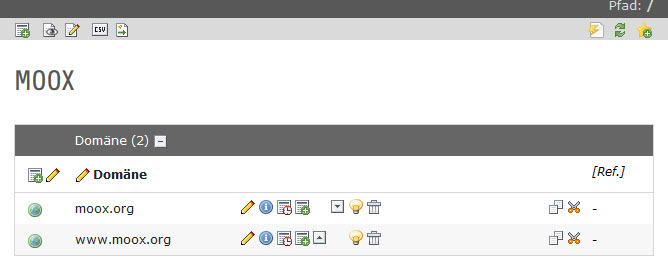


.. ==================================================
.. FOR YOUR INFORMATION
.. --------------------------------------------------
.. -*- coding: utf-8 -*- with BOM.

.. ==================================================
.. DEFINE SOME TEXTROLES
.. --------------------------------------------------
.. role::   underline
.. role::   typoscript(code)
.. role::   ts(typoscript)
   :class:  typoscript
.. role::   php(code)

MOOX\_CORE
""""""""""

**Global page title** – Sets your page-title shown in the Browser-
Window and in Search-Engines result pages.

**domain** – enter the domain-name like www.moox.org

**main menu entry level** – the entry level of the main menu mostly
“1” or “2” will meet your requirements. All submenues of the page will
be calculated on behalf of this value.

MOOX\_CORE\_COOKIES
"""""""""""""""""""

**Use Cookie Compliance** – enables the cookie compliance message
shown in the first screenshot

**Cookie Settings Page PID** – sets the informational page (maybe some
informational page or the page where tracking can be disabled on users
request.

**Cookie Alert Box Position** – choose top or bottom depending on your
layout

MOOX\_ANALYTICS
"""""""""""""""

**Use Piwik** – Enables Piwik

**Piwik URL** – like www.moox.org/piwik

**ID Site** – the Site-ID (you get the ID within Piwik if you install
it)

**Use Google Analytics** – Enables Google Analytics

**UA-XXXX-XX** – The ID told you by Google Analytics

**Enable Site-verification** – Enables Google Webmaster Tools

**Google-Site-verification** – The ID told you by GWT

We recommend using Piwik ( `http://www.piwik.org
<http://www.piwik.org/>`_ ) as it is Open Source and you own the data.
You may also use `http://www.google.com/analytics/
<http://www.google.com/analytics/>`_ and
`https://www.google.com/webmasters/tools/
<https://www.google.com/webmasters/tools/>`_

MOOX\_CORE\_META
""""""""""""""""

- **Select yout Page type** – “Website” should be good ;-)

- **Latitude of a Point** – Give your latidude

- **Longitude of a Point** – Give your longitude

- **Region** – You may enter your GEO-Region like DE-BW

- **Placename** – Enter your City

- **Select your robots settings** – “all” does well

- **Statusbar color** – the statusbar for WebApps

- **MS Application title color** - the Microsoft pendant

You may use `http://www.geo-tag.de/generator/ <http://www.geo-
tag.de/generator/>`_ to get all set up.

Additional configuration options may be shipped with your MOOX
Template, check the category dropdown for further entries like MOOX-
TEMPLATE-XXX.

You may add one or two Domain Records on you Root-Page to get your
project running with and without the www-prefix.

