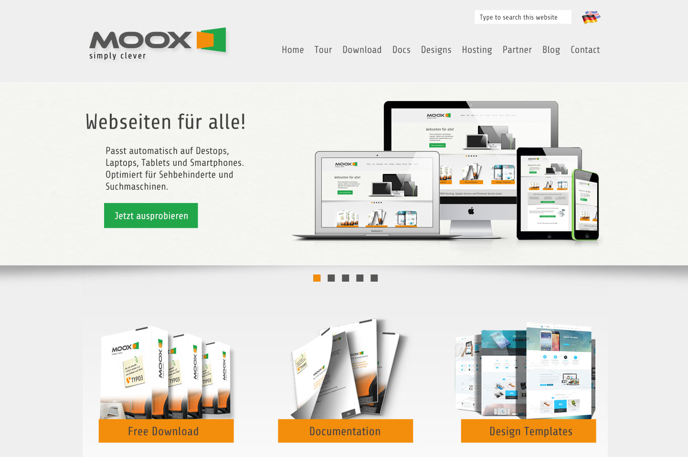
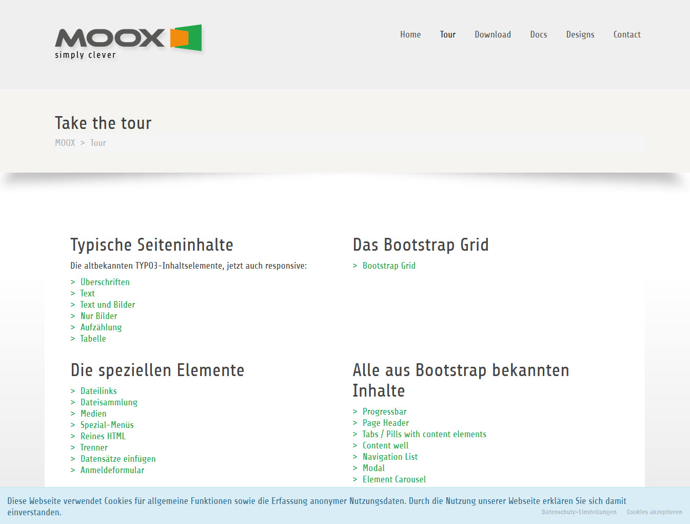

.. include:: Images.txt

.. ==================================================
.. FOR YOUR INFORMATION
.. --------------------------------------------------
.. -*- coding: utf-8 -*- with BOM.

.. ==================================================
.. DEFINE SOME TEXTROLES
.. --------------------------------------------------
.. role::   underline
.. role::   typoscript(code)
.. role::   ts(typoscript)
   :class:  typoscript
.. role::   php(code)

Screenshots
^^^^^^^^^^^

Visit `http://www.moox.org <http://www.moox.org/>`_ to see MOOX in
action. Here are some additional Screenshots for a quick preview. The
Frontend Output of MOOX Bootstrap Responsive with additional Sequence
Slider showing the responsive views of the same website:

moox\_core renders all known TYPO3 content elements including Textpic
as well as all known Bootstrap Elements in a mobile- and tablet-
optimized manner (so called responsive). At the bottom of the page you
can see the compliance to the EU cookie law regulations.

Welcome to MOOX. Our neat Dashboard gives you a warm welcome. The
dashboard will soon be evolved to give you more information about your
system status and fast access to main features of MOOX.

.. image:: ../../../Images/manual_html_202e19c4.jpg

Features
^^^^^^^^

- Auto-Installation and easy configuration
- Responsive Bootstrap-Layout and Content-Elements
- Built on HTML5 Boilerplate, Validated and accesible
- Using only jQuery and compatible plugins
- Superfish responsive Dropdown Navigation
- SEO: robots.txt, Google Sitemap (sitemap.xml) and Metatags
- Nice URLs through RealURL and .htaccess
- EU Cookie Law Compliance
- Piwik or Google Analytics ready
- Prepared for site-verification through Google Webmaster Tools (GWT)
- Supports CDN Usage (e. g. Amazon Cloudfront)
- Use Webfonts like Google Fonts or Fonts.com
- Use Glyphicons or FontAwesome
- Support Multilanguage, integrated configurable language-switcher
- Easy to template and CSS-style
- Easy to extend with own Content Elements and Effects
- Good foundation to start own Extension Development
- Favicon and App-Iconset (comes with any MOOX Template)
- Prepared for Indexed Search, SOLR and Powermail
- Content-Import from other TYPO3-Installations (like Templavoila) possible
