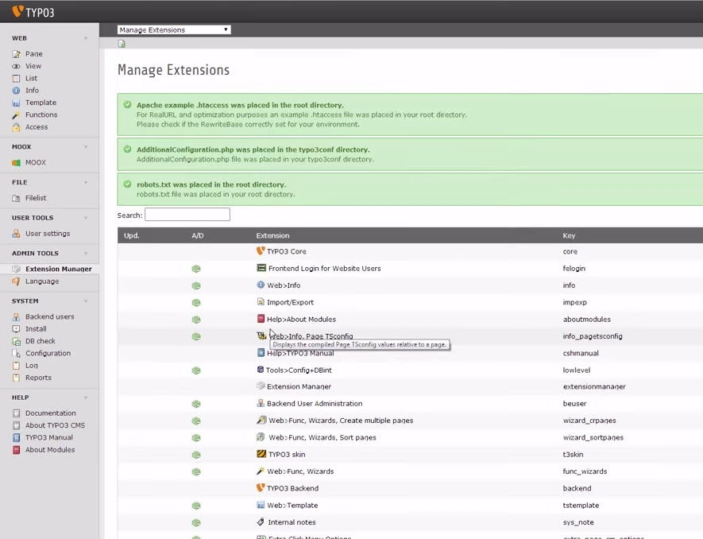

.. include:: Images.txt

.. ==================================================
.. FOR YOUR INFORMATION
.. --------------------------------------------------
.. -*- coding: utf-8 -*- with BOM.

.. ==================================================
.. DEFINE SOME TEXTROLES
.. --------------------------------------------------
.. role::   underline
.. role::   typoscript(code)
.. role::   ts(typoscript)
   :class:  typoscript
.. role::   php(code)

Sponsors
^^^^^^^^

This Extension is developed by DCN GmbH ( `http://www.dcn.de
<http://www.dcn.de/>`_ ).

If you want to donate us, contact `moox@dcn.de <mailto:moox@dcn.de>`_
and we will add you here and on our sponsor page
`http://www.moox.org/partner/sponsors
<http://www.moox.org/en/partner/sponsors>`_

MOOX relies on the work of the FluidTYPO3-Team and we love fluid and
fedext (yep, we started with the old fedext ;-) ... so much
appreciating the work of Claus Due aka NamelessCoder an his great
team, thanks 1000 times <3 <3 <3

MOOX News is a fork of tx\_news, thanks to Georg Ringer. Very good
job!

The biggest part of MOOX is sponsored by Chemieverbände Baden-Württemberg ( `http://www.chemie.com
<http://www.chemie.com/>`_ ).

Users manual
^^^^^^^^^^^^

Choose a MOOX Template on `http://www.moox.org/designs
<http://www.moox.org/designs>`_ on a newly installed TYPO3.

OR

Install MOOX Template Builder (moox\_template\_builder) to create an
own responsive website template with MOOX.

In both ways moox\_core and all needed MOOX Extensions will be
installed automatically.

OR

Install moox\_core without any template (FE-Output will be very basic
of course).

The MOOX Core-Extension will …

… install the Extension - VHS: Fluid View Helpers (vhs)

… install the Extension - Flux: Fluid Flexforms (flux)

… install the Extension - Fluid Pages Engine (fluidpages)

… install the Extension - Fluid Content Engine (fluidcontent)

… install the Extension - RealURL: speaking paths for TYPO3 (realurl)

… create a .htaccess-File (for RealURL and optional Static File Cache)

… create a robots.txt File (Standard-configured for search engines)

… automatically configure RealURL

… create an AdditionalConfiguration.php to enable our content
controller

… create a sitemap.xml

MOOX Templates will

… copy some folders and contents to the fileadmin-directory (CSS,
Images)

… do some magic

Screen of the Extension Manager after installing moox\_core. You
should see three green message boxes stating the correct installation
of the .htacces, AdditionalConfiguration.php and robots.txt.

Got red or grey messages? Read them and refer to the Known Bugs
Section if unsure what to do.

After installation, there are a few steps to get MOOX running. Please
refer to the Configuration section for more information.

